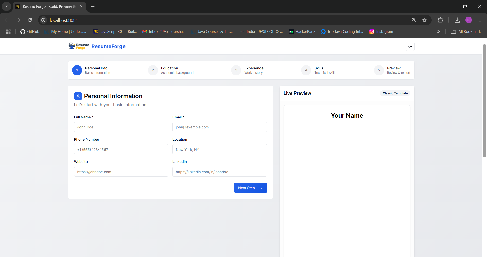
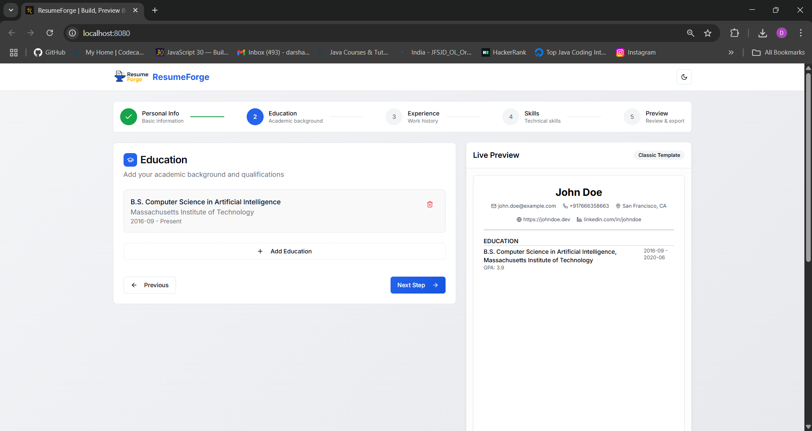
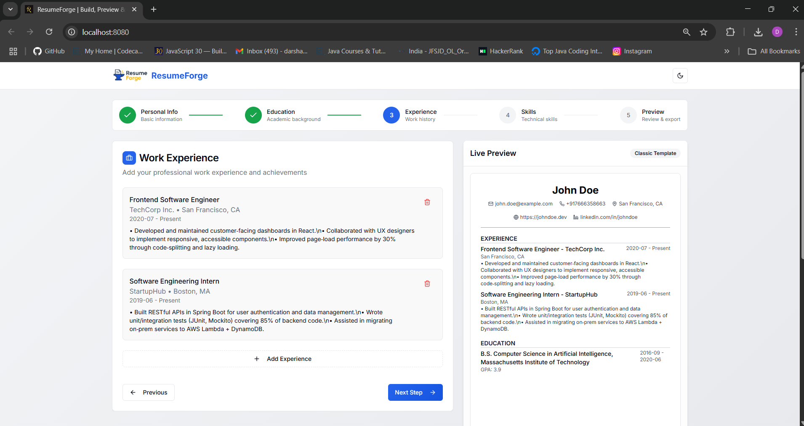
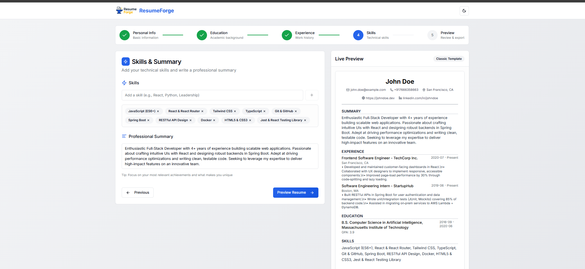
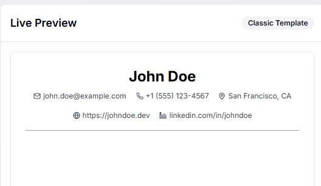
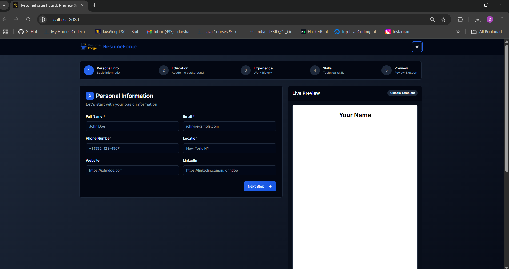
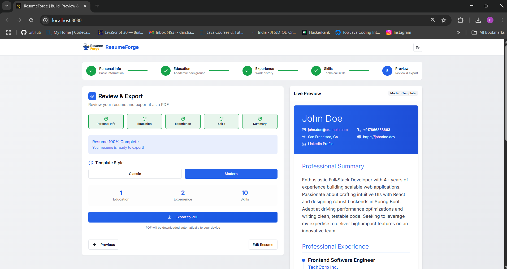

# ResumeForge - Professional Resume Creator

A modern, responsive React application for creating professional resumes with live preview and PDF export functionality, designed and built by **Darshan Chaudhari**.

---

## 👤 Author

**Darshan Chaudhari**
📞 +91-7666358663
📍 Maharashtra, India
✉️ [darshaudhari4998@gmail.com](mailto:chaudharidarshan155@gmail.com)

**Portfolio:** [https://darshanchaudharii.github.io/portfolio/](https://darshanchaudharii.github.io/portfolio/)
**LinkedIn:** [https://linkedin.com/in/darshan-chaudhari-81600118b](https://linkedin.com/in/darshan-chaudhari-81600118b)
**GitHub:** [https://github.com/darshanchaudharii](https://github.com/darshanchaudharii)

---

## ✨ Features

* **Multi-Step Guided Form**: Intuitive 5-step process to collect **Personal Info**, **Education**, **Experience**, **Skills**, and **Preview**.
* **Live Preview**: Real-time resume rendering alongside the form, ensuring you see changes instantly.
* **PDF Export**: Download a high-quality PDF of your resume using **html2canvas** and **jsPDF**.
* **Template Selection**: Switch between **Classic** and **Modern** resume templates.
* **Dark/Light Mode**: Toggle between themes for comfortable editing day or night.
* **Data Persistence**: Automatic saving to **localStorage**—never lose your progress.
* **Responsive Design**: Mobile-first approach with smooth layout adjustments across devices.
* **Form Validation**: Built-in checks to ensure all required fields are correctly filled.

---

## 🚀 Quick Start

### Prerequisites

* Node.js 18+ and npm or Yarn

### Installation

```bash
# Clone the repository
git clone https://github.com/darshanchaudharii/resume-craft-studio-76-main.git
cd resume-craft-studio-76-main

# Install dependencies with npm
tnpm install
# or with yarn
yarn install

# Start development server
npm run dev
```

Open your browser at `http://localhost:8080` to begin crafting your resume.

---

## 📁 Project Structure

```
resume-craft-studio-76-main/
├── public/                # Static assets
├── ScreenShots/           # UI screenshots used in documentation
│   ├── Homepage.png
│   ├── AfterAddingProfile.png
│   ├── AfterAddingEdu.png
│   ├── AddingSkills.png
│   ├── ExperiencePage.png
│   ├── DarkTheme.png
│   ├── EducationPage.png
│   └── ExitPage.png
├── src/
│   ├── components/        # Reusable UI components (Navbar, Footer)
│   ├── pages/             # Step form pages and preview
│   ├── hooks/             # Custom React hooks
│   ├── context/           # Global state management
│   ├── lib/               # Utility functions
│   └── App.tsx            # Main application root
├── index.html             # App shell
├── package.json           # Project metadata & scripts
└── tailwind.config.ts     # Tailwind CSS configuration
```

---

## 🎯 Usage Guide

1. **Personal Information**
   
   Enter your name, email, phone number, location, website, and LinkedIn URL. Click **Next Step** to proceed.

2. **Education**
   
   Add one or more academic entries with institution, degree, start/end dates, and GPA.

3. **Experience**
   
   List your work history, including role, company, duration, and bullet-point descriptions of achievements.

4. **Skills**
   
   Add relevant technical and soft skills as tags. Ensure you highlight your key proficiencies.

5. **Preview & Export**
   
   Review the live preview in your selected template. Toggle **Dark/Light Mode** if desired. Click **Export PDF** to download.

6. **Dark Mode**
   
   Switch themes for a comfortable editing experience in any lighting.

7. **Completion**
   
   Upon completion, your resume is ready to share or print.

---

## 🛠 Development Scripts

* `npm run dev` — Start the development server
* `npm run build` — Build for production
* `npm run preview` — Preview production build
* `npm run lint` — Run ESLint checks

---

## 🤝 Contributing

Contributions are welcome! To propose changes:

1. Fork the repo
2. Create a new branch (`git checkout -b feature/awesome`)
3. Commit your changes (`git commit -m 'Add awesome feature'`)
4. Push to your branch (`git push origin feature/awesome`)
5. Open a Pull Request

---

**Built by Darshan Chaudhari**
